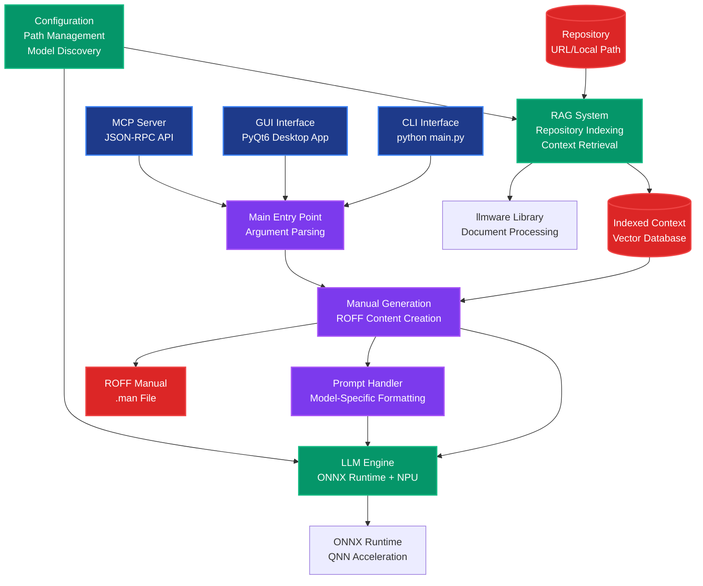

# Auto-Man

NPU-Accelerated Manual Generator

Auto-Man is a powerful tool that leverages Neural Processing Units (NPUs) and Large Language Models to automatically generate comprehensive manual pages (.man files) for software projects. It can analyze code repositories and create professional documentation with minimal user intervention.

## Architecture Overview



## Features

- **NPU Acceleration**: Leverages ONNX Runtime with QNN (Qualcomm Neural Network) support for optimal performance on compatible hardware
- **Multi-Modal Interface**: Command-line interface with optional PyQt6 GUI
- **Repository Analysis**: Automatically indexes and analyzes code repositories
- **LLM Integration**: Uses state-of-the-art language models for documentation generation
- **MCP Server Support**: Includes Model Context Protocol server for integration with other tools
- **Cross-Platform**: Works on Windows, Linux, and macOS

## Installation

### Prerequisites

- Python 3.12 or higher
- uv package manager

### Quick Start

1. **Clone or download the repository:**
```bash
git clone <repository-url>
cd golan-auto-man
```

2. **Install dependencies using uv:**
```bash
# Install core dependencies
uv sync

# Optional: Install with NPU acceleration support for Qualcomm devices
uv sync --extra npu

# Optional: Install development dependencies (testing, linting, etc.)
uv sync --dev
```

3. **Verify installation:**
```bash
# Check that the CLI tool is available
auto-man --help
```

## Usage

### Command Line Interface

The CLI provides multiple modes of operation for different use cases.

#### Basic Usage

**Generate a manual for a repository:**
```bash
# Using the installed script
auto-man -r https://github.com/user/repo

# Or using Python module directly
python -m auto_man.main -r https://github.com/user/repo
```

#### Command Line Options

| Option | Description |
|--------|-------------|
| `-m, --model_path PATH` | Path to custom model directory |
| `-r, --repo URL/PATH` | Repository URL or local path to analyze |
| `-p, --prompt TEXT` | Run single prompt generation (bypasses repo analysis) |
| `--mcp` | Start MCP server for tool integration |
| `--gui` | Launch PyQt6 graphical interface |
| `--reset` | Clear cache and remove custom models |
| `-v, --verbose` | Enable verbose output |
| `-h, --help` | Show help message |

#### Usage Examples

**Generate documentation for a GitHub repository:**
```bash
auto-man -r https://github.com/microsoft/vscode
```

**Generate documentation for a local project:**
```bash
auto-man -r /path/to/my/project
```

**Launch the graphical interface:**
```bash
auto-man --gui
```

**Run a single prompt for testing:**
```bash
auto-man -p "Explain how neural networks work"
```

**Start MCP server for integrations:**
```bash
auto-man --mcp
```

**Reset environment (clear cache and custom models):**
```bash
auto-man --reset
```

**Use custom model path:**
```bash
auto-man -m /path/to/custom/models -r https://github.com/user/repo
```

### GUI Mode

Launch the graphical user interface:
```bash
python main.py --gui
```

The GUI provides an intuitive way to:
- Browse and select repositories (local or remote)
- Configure model settings and NPU acceleration
- Monitor generation progress in real-time
- View and edit generated ROFF documentation
- Export manuals to various formats

### Output Format: ROFF Manuals

Auto-Man generates documentation in **ROFF format** (`.man` files), the standard format for Unix/Linux manual pages. ROFF is a typesetting system that produces formatted text output.

**Viewing ROFF manuals:**

```bash
# View a generated manual page
man ./generated_manual.man

# Or use nroff for plain text output
nroff -man ./generated_manual.man | less

# Convert to PDF (requires groff)
groff -man -Tpdf ./generated_manual.man > manual.pdf

# Convert to HTML
groff -man -Thtml ./generated_manual.man > manual.html
```

**ROFF Structure:**
- `.TH`: Title header
- `.SH`: Section headers (NAME, SYNOPSIS, DESCRIPTION, etc.)
- `.B`: Bold text
- `.I`: Italic text
- Standard man page sections for consistency

### MCP Server Mode

Auto-Man includes a Model Context Protocol server for integration with compatible tools:

```bash
python main.py --mcp
```

The MCP server exposes endpoints for:
- Repository analysis and indexing
- Context retrieval
- Documentation generation

## Model Support

Auto-Man supports various ONNX-compatible models for NPU acceleration. Models should be placed in the `models/` directory with the following structure:

```
models/
├── model_repo/          # Default model repository (auto-created)
│   └── [model-name]/
│       └── model.onnx
└── [custom-models]/     # Custom model directories
    └── model.onnx
```

### Supported Model Formats

- **ONNX models with QNN optimization**: Optimized for Qualcomm Neural Network acceleration
- **Hugging Face model repositories**: Automatic download and conversion
- **Local model files**: Direct ONNX file support
- **GGUF models**: Via llama.cpp integration (planned)

### Model Requirements

- **Minimum RAM**: 4GB for small models, 16GB+ recommended for larger models
- **NPU Support**: Qualcomm Snapdragon devices with Hexagon NPU
- **Storage**: 2-10GB per model depending on size and quantization

## Configuration

### Environment Setup

The tool automatically creates necessary directories:
- `models/`: Model storage
- `.cache/`: Temporary cache files

### Model Configuration

Models are automatically detected from the `models/` directory. You can specify a custom model path using the `--model_path` option.

## Architecture

Auto-Man follows a modular architecture with clear separation of concerns, organized as a Python package under `src/auto_man/`. Each module handles a single responsibility:

### Core Components

- **Configuration** (`config.py`): Centralized path management, model discovery, and shared constants
- **Prompt Handling** (`prompting.py`): Model-specific prompt formatting and template management
- **Manual Generation** (`manual_generation.py`): Pure functions for generating and cleaning manual pages
- **CLI Workflows** (`cli.py`): High-level functions for different CLI operations (MCP mode, single prompts, repo processing)
- **Main Entry** (`main.py`): Thin CLI argument parsing and orchestration layer

### Infrastructure Components

- **LLM Engine** (`llm_engine.py`): Language model inference with NPU acceleration support
- **RAG System** (`rag.py`): Retrieval-Augmented Generation for codebase indexing and context retrieval
- **MCP Server** (`mcp_server.py`): Model Context Protocol server for external integrations
- **GUI** (`gui.py`): PyQt6 graphical interface for interactive usage
- **Build Tools** (`build.py`): PyInstaller configuration and desktop build utilities

## Development

### Setting up Development Environment

1. Install development dependencies:
```bash
uv sync --dev
```

2. Install pre-commit hooks:
```bash
pre-commit install
```

### Project Structure

```
.
├── src/
│   └── auto_man/                    # Main Python package
│       ├── __init__.py
│       ├── main.py                  # CLI entry point and argument parsing
│       ├── cli.py                   # CLI workflow functions (MCP, single prompts, repo processing)
│       ├── config.py                # Shared configuration, path management, model discovery
│       ├── prompting.py             # Prompt handling and model-specific formatting
│       ├── manual_generation.py     # Core manual page generation logic (ROFF content)
│       ├── llm_engine.py            # LLM inference engine with NPU acceleration
│       ├── rag.py                   # RAG system for repository indexing and context retrieval
│       ├── mcp_server.py           # Model Context Protocol server for tool integration
│       ├── gui.py                   # PyQt6 graphical user interface
│       └── build.py                 # PyInstaller configuration for desktop builds
├── tests/                           # Comprehensive test suite
│   ├── conftest.py                  # Test fixtures, mocks, and configuration
│   ├── test_llm_engine.py          # LLM engine tests
│   ├── test_rag.py                  # RAG system tests
│   ├── test_mcp_server.py          # MCP server integration tests
│   ├── test_prompting.py           # Prompt handling tests
│   ├── test_manual_generation.py   # Manual generation tests
│   └── test_main_cli.py            # CLI entry point tests
├── pyproject.toml                   # Project configuration (dependencies, scripts, build settings)
├── .gitignore                       # Git ignore patterns (cache, models, venv, etc.)
└── README.md                        # This documentation file
```

### Key Directories Created at Runtime

```
├── models/                          # Model storage directory (created automatically)
│   └── model_repo/                  # Default model repository
└── .cache/                          # Temporary cache files (created by RAG system)
```

### Running Tests

Auto-Man includes a comprehensive test suite built with pytest, providing extensive coverage of all core functionality.

#### Test Structure

The test suite covers all major components:

- **`test_main_cli.py`**: CLI entry point and argument parsing
- **`test_manual_generation.py`**: ROFF manual generation logic
- **`test_llm_engine.py`**: LLM inference engine functionality
- **`test_rag.py`**: Repository indexing and context retrieval
- **`test_mcp_server.py`**: MCP server integration and API
- **`test_prompting.py`**: Prompt formatting and model compatibility
- **`conftest.py`**: Shared test fixtures and mock objects

#### Running Tests

```bash
# Install test dependencies
uv sync --dev

# Run all tests
pytest

# Run tests with coverage report
pytest --cov=auto_man --cov-report=html
pytest --cov=auto_man --cov-report=term-missing

# Run specific test file
pytest tests/test_llm_engine.py

# Run tests in verbose mode
pytest -v

# Run tests with detailed output
pytest -vv

# Run tests matching a pattern
pytest -k "test_manual" -v

# Run tests and stop on first failure
pytest -x

# Generate coverage badge (requires coverage-badge)
coverage-badge -o coverage.svg
```

#### Test Fixtures

The test suite uses comprehensive fixtures defined in `tests/conftest.py`:

- **Mock LLM Engine**: Simulates model inference without requiring actual models
- **Mock RAG System**: Provides fake indexed repository data
- **Temporary Directories**: Isolated test environments
- **Mock File Systems**: Controlled file operations for testing
- **Mock MCP Server**: Simulated JSON-RPC interactions

#### Continuous Integration

Tests are designed to run in CI environments and include:

- **Cross-platform compatibility** testing
- **Dependency isolation** to prevent interference
- **Mock external services** (Hugging Face, model downloads)
- **Performance assertions** for critical paths

#### Writing New Tests

When adding new functionality, follow these patterns:

```python
import pytest
from unittest.mock import Mock, patch

def test_new_feature(mock_llm_engine, mock_rag_system):
    """Test description of new feature."""
    # Arrange
    # Act
    # Assert
```

All tests should include proper mocking to avoid external dependencies and focus on unit behavior.

## Contributing

1. Fork the repository
2. Create a feature branch
3. Make your changes
4. Run tests and linting
5. Submit a pull request

## License

This project is licensed under the MIT License - see the LICENSE file for details.

## Troubleshooting

### Common Issues and Solutions

#### Model and NPU Issues

**Model Loading Errors:**
- Ensure model files are in ONNX format with `.onnx` extension
- Check file permissions on model directories
- Verify model compatibility with your hardware
- Use `--verbose` flag for detailed loading information

**NPU Acceleration Not Working:**
- Confirm you have a Qualcomm device with Hexagon NPU
- Install NPU extras: `uv sync --extra npu`
- Check ONNX Runtime QNN version compatibility
- Fallback to CPU inference if NPU fails

#### Repository Processing Issues

**Repository Not Found:**
- Verify URL is accessible and public
- For private repos, ensure authentication is configured
- Check network connectivity and firewall settings
- Use `--verbose` for connection details

**Large Repository Timeout:**
- Break large repositories into smaller components
- Use local repository analysis for better performance
- Increase timeout settings in configuration

#### GUI and Interface Issues

**GUI Not Starting:**
- Ensure PyQt6 is installed: `uv sync`
- Check display environment (X11/Wayland on Linux)
- Verify Python Qt bindings are compatible
- Try running with `QT_DEBUG_PLUGINS=1` for diagnostics

**MCP Server Connection Issues:**
- Verify server is running on expected port (default: stdin/stdout)
- Check JSON-RPC message format
- Ensure client supports MCP protocol version 2024-11-05
- Use `--verbose` for server communication logs

#### Performance Issues

**Slow Generation:**
- Use NPU acceleration where available
- Ensure sufficient RAM (16GB+ recommended)
- Clear cache with `--reset` if corrupted
- Use smaller models for faster processing

**Memory Errors:**
- Reduce batch sizes in configuration
- Use CPU-only mode if GPU/NPU memory is insufficient
- Process smaller repositories or code sections

### Getting Help and Support

- **Verbose Logging**: Use `-v/--verbose` flag for detailed diagnostics
- **Version Check**: Ensure Python 3.12+ and compatible dependencies
- **Environment Info**: Report OS, Python version, and hardware details
- **Log Files**: Check `.cache/` directory for error logs
- **Reset Environment**: Use `--reset` to clear corrupted state

## Changelog

### v0.1.0
- Initial release
- NPU acceleration support
- CLI and GUI interfaces
- MCP server integration
- Repository analysis and documentation generation
