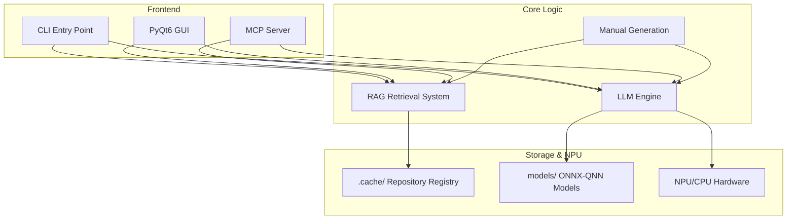

# Auto-Man: NPU-Accelerated Manual Generator

Auto-Man is a high-performance tool designed to generate technical manual pages (.man) and documentation directly from source code repositories. It leverages local NPU (Neural Processing Unit) acceleration via `llmware` and ONNX for fast, private, and efficient processing.

## Architecture

Auto-Man is built on a modular architecture designed for high performance and extensibility.



## Directory Structure

```text
auto-man/
├── src/auto_man/           # Core source package
│   ├── main.py             # Entry point for all modes
│   ├── cli.py              # CLI logic and workflows
│   ├── config.py           # Path and environment configuration
│   ├── gui.py              # PyQt6 graphical interface
│   ├── llm_engine.py       # NPU-accelerated inference
│   ├── mcp_server.py       # Model Context Protocol implementation
│   ├── rag.py              # Repository analysis and RAG logic
│   ├── prompting.py        # Model-specific prompt templates
│   ├── manual_generation.py # ROFF formatting and sanitization
│   └── build.py            # Desktop build scripts
├── tests/                  # Pytest suite
├── models/                 # ONNX model repository
├── pyproject.toml          # Package configuration and dependencies
└── README.md               # Documentation
```

## Features

- **NPU Acceleration**: Optimized for local execution using ONNX-QNN and ONNX-GenAI.
- **RAG-Powered**: Uses Retrieval-Augmented Generation to understand large codebases accurately.
- **MCP Server**: Implements the Model Context Protocol (MCP) for integration with modern AI tools like Claude Desktop.
- **Cross-Platform GUI**: Built with PyQt6 for a user-friendly repository indexing and generation experience.
- **Automated .man Generation**: Produces standard ROFF-formatted manual pages ready for Unix/Linux systems.

## Installation

### Prerequisites

- **Python 3.12**: ARM64 version is required for NPU acceleration on supported hardware.
- **NPU Drivers**: Ensure Qualcomm NPU drivers are installed for `onnxruntime-qnn` support.

### Setup

1. **Clone the repository**:
   ```bash
   git clone https://github.com/your-repo/auto-man.git
   cd auto-man
   ```

2. **Create and activate a virtual environment**:
   ```bash
   python -m venv .venv
   .\.venv\Scripts\activate
   ```

3. **Install the package and dependencies**:
   ```bash
   pip install .
   ```

4. **Install optional development dependencies**:
   ```bash
   pip install ".[dev]"
   ```

## Usage

### CLI Command Reference

| Flag | Description | Example |
|------|-------------|---------|
| `--repo, -r` | Local path or remote Git URL to index | `--repo https://github.com/user/project` |
| `--prompt, -p` | Run a single LLM prompt against indexed context | `--prompt "Summarize main.py"` |
| `--gui` | Launch the PyQt6 desktop interface | `--gui` |
| `--mcp` | Start the MCP server for tool integration | `--mcp` |
| `--model_path, -m` | Custom path to model directory | `-m ./models/my-custom-model` |
| `--reset` | Clear the repository registry and reset environment | `--reset` |

### Manual Page Generation

The primary function of Auto-Man is generating `.man` files. These are ROFF-formatted files used for Linux/Unix documentation.

**Viewing Generated Manuals**:
On Linux/macOS:
```bash
man ./your-project.man
```
On Windows:
```bash
# View as plain text
type .\your-project.man
```

## Model Support

Auto-Man is optimized for `qwen2.5-7b-instruct-onnx-qnn` and supports:
- **Formats**: ONNX (Optimized for QNN), GGUF (via fallback).
- **Quantization**: INT4/INT8 recommended for optimal NPU performance.
- **Hardware**: Snapdragon X Elite/Plus NPUs (via ONNX-QNN execution provider).

## Development & Testing

### Running Tests
The project includes a comprehensive test suite using `pytest`:
```bash
pytest
```

### Code Quality
Maintain standards using the development toolchain:
```bash
# Format code
black .
isort .

# Static analysis
flake8 .
mypy .
```

## Troubleshooting

| Issue | Solution |
|-------|----------|
| **NPU not found** | Ensure you are using Python 3.12 ARM64 and have the `onnxruntime-genai` package installed from the ORT-Nightly index if needed. |
| **Import errors** | Ensure your virtual environment is activated and you have run `pip install .`. |
| **RAG indexing fails** | Ensure the repository path is valid and accessible. Remote URLs require `git` to be installed. |
| **GUI won't launch** | Check if your environment supports PyQt6. On Linux, ensure X11/Wayland dependencies are present. |

## License

[Add License Information Here]
